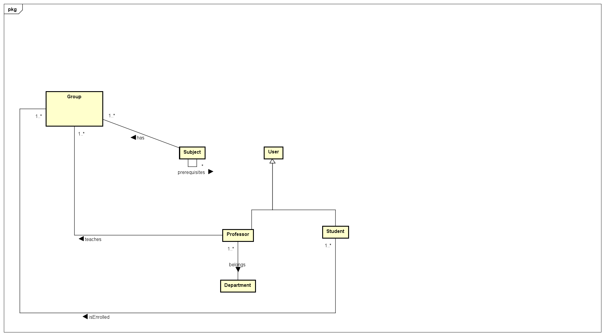
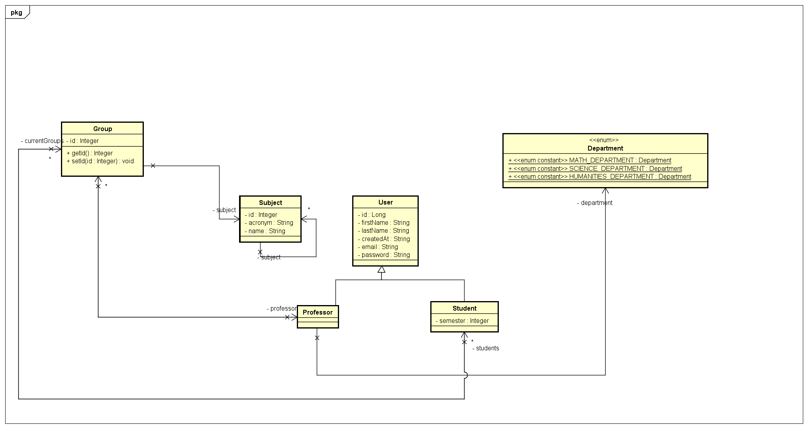

<<<<<<< HEAD
# CAIS-TALLER03 - GitHub Actions Workshop 🛠️

**Asignatura:** CAIS (Construcción de Aplicaciones Informáticas Seguras)  
**Autor:** Ivan Camilo Rincon Saavedra

## Descripción

Este repositorio contiene el material y configuración para el **Taller Práctico de GitHub Actions**. En este espacio trabajaremos en parejas para configurar un pipeline completo de CI/CD que incluye todas las mejores prácticas de desarrollo seguro y calidad de código.

## Objetivos del Taller 🎯

En la próxima sesión tendremos un taller práctico sobre GitHub Actions 🛠️. En este espacio trabajaremos en parejas configurando un pipeline que incluya:

### Componentes Principales del Pipeline

1. **Build del proyecto** 🏗️
   - Compilación automática del código fuente
   - Gestión de dependencias
   - Generación de artefactos de construcción

2. **Code Analysis con SonarCloud** 🔍
   - Análisis estático de código
   - Detección de vulnerabilidades de seguridad
   - Evaluación de calidad y mantenibilidad del código
   - Identificación de code smells y bugs
   - *Nota: También se pueden usar otras herramientas de análisis como CodeQL, ESLint, etc.*

3. **Pruebas unitarias** ✅
   - Ejecución automática de tests
   - Generación de reportes de cobertura
   - Validación de funcionalidades críticas
   - Integración con frameworks de testing

4. **Paso adicional a elección** ⚡
   - **Linting:** Verificación de estilo de código
   - **Coverage:** Análisis detallado de cobertura de código
   - **Deploy ficticio:** Simulación de despliegue a diferentes entornos
   - **Security scanning:** Análisis de dependencias vulnerables
   - **Performance testing:** Pruebas de rendimiento
   - **Documentation generation:** Generación automática de documentación

## Dinámica del Taller 👥

👉 **Metodología de trabajo:**
- Trabajo en **parejas** para fomentar el aprendizaje colaborativo
- Configuración paso a paso del pipeline de GitHub Actions
- Implementación práctica de cada componente
- Resolución colaborativa de problemas
- Revisión y feedback entre equipos

### Estructura de la Sesión

1. **Introducción teórica** (20 min)
   - Conceptos fundamentales de CI/CD
   - Introducción a GitHub Actions
   - Mejores prácticas de seguridad

2. **Configuración práctica** (60 min)
   - Setup del repositorio
   - Creación del workflow principal
   - Configuración de cada componente del pipeline

3. **Implementación y testing** (40 min)
   - Ejecución de los pipelines
   - Debugging y resolución de problemas
   - Optimización de los workflows

4. **Presentación y revisión** (20 min)
   - Demostración de los pipelines funcionando
   - Compartir experiencias y aprendizajes
   - Feedback y mejoras sugeridas

## Tecnologías y Herramientas 🔧

- **GitHub Actions** - Plataforma de CI/CD
- **SonarCloud** - Análisis de calidad de código
- **JUnit/TestNG** - Framework de pruebas unitarias (para Java)
- **Maven/Gradle** - Gestión de dependencias y build
- **Docker** - Containerización (opcional)

## Estructura del Proyecto 📁

```
CAIS-TALLER03/
├── .github/
│   └── workflows/
│       ├── ci.yml              # Pipeline principal de CI
│       ├── code-analysis.yml   # Análisis de código
│       └── security.yml        # Análisis de seguridad
├── src/
│   ├── main/                   # Código fuente
│   └── test/                   # Pruebas unitarias
├── docs/                       # Documentación
├── README.md
└── .gitignore
```

## Resultados Esperados 🎉

Al finalizar el taller, cada pareja habrá:

- ✅ Configurado un pipeline completo de CI/CD
- ✅ Implementado análisis de calidad de código
- ✅ Integrado pruebas automatizadas
- ✅ Añadido al menos un componente adicional de su elección
- ✅ Documentado el proceso y las lecciones aprendidas

## Recursos Adicionales 📚

- [GitHub Actions Documentation](https://docs.github.com/en/actions)
- [SonarCloud Setup Guide](https://sonarcloud.io/documentation)
- [CI/CD Best Practices](https://docs.github.com/en/actions/learn-github-actions/workflow-syntax-for-github-actions)

## Contribuciones 🤝

Este es un proyecto educativo. Las contribuciones y mejoras son bienvenidas a través de:
- Issues para reportar problemas o sugerir mejoras
- Pull Requests con nuevas funcionalidades o correcciones
- Documentación adicional y ejemplos

---

**Nota:** Este repositorio es parte del material educativo de la asignatura CAIS y está diseñado con fines académicos para el aprendizaje de tecnologías de CI/CD y desarrollo seguro.
=======
# Proyecto-Sistema-Registro-Academico

# Read Me First
The following was discovered as part of building this project:

* The original package name 'org.perficient.registration-system' is invalid and this project uses 'org.perficient.registrationsystem' instead.

# Getting Started

### Reference Documentation
For further reference, please consider the following sections:

* [Official Apache Maven documentation](https://maven.apache.org/guides/index.html)
* [Spring Boot Maven Plugin Reference Guide](https://docs.spring.io/spring-boot/docs/2.7.3/maven-plugin/reference/html/)
* [Create an OCI image](https://docs.spring.io/spring-boot/docs/2.7.3/maven-plugin/reference/html/#build-image)
* [Spring Web](https://docs.spring.io/spring-boot/docs/2.7.3/reference/htmlsingle/#web)

### Guides
The following guides illustrate how to use some features concretely:

* [Building a RESTful Web Service](https://spring.io/guides/gs/rest-service/)
* [Serving Web Content with Spring MVC](https://spring.io/guides/gs/serving-web-content/)
* [Building REST services with Spring](https://spring.io/guides/tutorials/rest/)


## Entity diagram



## Class diagram



>>>>>>> f875b93132f65d75bc0ede8c38bba0f63b3d07c9
